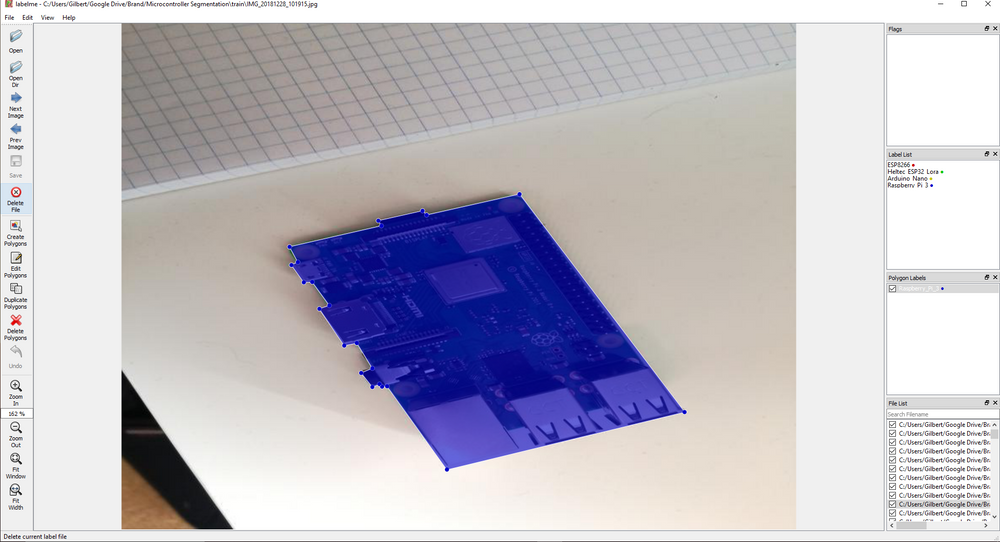

# Create input images with LabelMe

LabelMe is an actively developed open source graphical image annotation tool inspired by [http://labelme.csail.mit.edu/](http://labelme.csail.mit.edu/).

First, install LabelMe:

```
pip install labelme
```

Next, open LabelMe by typing `labelme` inside the command line. Then click on "Open Dir" and select the directory containing the images you want to label, and start labeling your images.



After labeling a few images using LabelMe you can extract the labeled objects using the [*create_input_images_from_labelme.py* file](../create_input_images_from_labelme.py).

```
usage: create_input_images_from_labelme.py [-h] --input_dir INPUT_DIR
                                           --output_dir OUTPUT_DIR

Extract objects from data labeled with labelme

optional arguments:
  -h, --help            show this help message and exit
  --input_dir INPUT_DIR
                        Path to input images and labels
  --output_dir OUTPUT_DIR
                        Path where output images will be saved
```

Example:

```
python create_input_images_from_labelme.py --input_dir labelme_output/ --output_dir input/foregrounds/
```
 